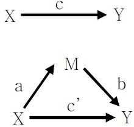

# BigContest2020 통계 이론

### (1) 매개효과이론
- Baron, R. M., Kenny, D. A.. (1986)The moderator-mediator variable distinction in social psychological research.Journal of Personality and Social Psychology 51(6) : 1173-1182 10.1037/0022-3514.51.6.1173

- 특정 현상을 설명하기 위해 더욱 많은 변인들을 포함한 연구모형을 사용하는 경향이 늘어나고 있다. 그런데 다양한 변인들 간의 인과관계를 규명하는 데 있어서 대표적으로 활용되는 접근법은 다른 변인들 간의 관계에 대해 매개효과(mediation effect)를 가지는 변인을 조사하는 것
- 매개 변수의 역할을 기준으로 Baron&Kenny는 매개효과의 유무를 검증하는 방법
- 매개효과를 완전매개효과 부분매개효과로 구분하는 방법 제안
- 너무 오래된 방법이고 정밀도가 낮아 Baron&Kenny 방법은 지양하는 분위기이며 완전매개, 부분매개 구분 또한 지양하는 분위기

- 조건
    -> 첫째 조건 : 독립변인이 매개변인에 유의한 영향(a)을 미쳐야 한다
    -> 둘째 조건 : 매개변인이 종속변인에 유의한 영향(b)을 미쳐야 한다
    -> 셋째 조건 : 다중회귀분석을 통한 독립변수와 매개변수가 종속변수에 미치는 영향을 분석

- 앞에 제시된 모든 조건이 만족되어야 매개효과가 있는 것이면 하나라도 통계적으로 유의하지 않으면 매개효과가 없는 것
- Baron과 Kenny의 접근법은 다른 방법에 비해 통계적 검증력이 약하다는 사실이 밝혀졌다(e.g., Fritz & MacKinnon, 2007; Mackinnon, Lockwood, & Williams, 2004; Hayes & Schaarkow, 2013)
- 문제점
    - 총 효과가 존재하지 않다고해서, 매개할 효과가 없다는 것은 사실이 아니다. (간접효과는 총 효과가 유의하지 않더라도 존재할 수 있다.)
    - 만약 M1을 통한 간접효과가 음수이고, M2를 통한 간접효과가 양수이며, 이 두 효과의 절대값이 같다면 총 효과는 0이 될 수 있다. -> 따라서 총 효과를 검증하는 과정을 버려야함
    - (개인생각) 직접효과는 무시하고 간접효과만 볼 경우에 대한 해석 : 직접효과라는건 사실 또 다른 간접효과로 나눠질 수 있음, 통상적으로 

- 적용
    ==> 즉 신규 코로나 확진자와 2020 유동인구의 비표준화 회귀계수를 통해 유의한지역
    ==> 2020 유동인구와 2020카드/편의점 매출액의 비표준화 회귀계수를 통해 유의한 지역
    ==> 신규 코로나 확진자와, 2020유동인구를 이용한 다중회귀 분석으로 2020카드 편의점매출액의 비표준화 회귀계수 2개를 구함

### (2) 소벨 테스트 [ 미사용 ]
- Sobel, M. E. (1982) 이 제안한 소벨 테스트
- 소벨 테스트는 Baron&Kenny의 매개효과 검증보다 엄격한 방식이며, 간접효과를 통해 매개효과 여부를 판단하는 방법
- Sobel test는 간접적으로 매개효과를 검증하는 것이 아니라 직접적으로 그 효과의 크기를 산출하여 검증한다는 점에서 Baron과 Kenny의 방법보다는 진일보한 방법이라고 볼 수 있다.
-  c와 c'의 크기를 비교하는 것이 아니라, 매개효과의 크기인 a × b를 산출하고, 분포 상에서의 표준오차로 그 값을 나눔으로써 영가설을 검증

- 표본의 크기가 클 때에는 위 두 개의 공식 모두 거의 동일한 값을 산출하는 것으로 알려져 있다(MacKinnon, Warsi, & Dwyer, 1995). 비교적 간단하게 매개효과를 검증할 수 있는 방법이기 때문에 Sobel test는 연구자들에 의해 자주 사용되어 왔다.
- 매개효과의 유의도를 검증할 때 그 값(즉 ab의 값)의 표본분포가 정상분포(z분포)를 이룬다는 가정을 하고 있는데, 여러 연구에서 밝혀졌듯이 매개효과의 분포는 정상분포가 아니라 대개 편포를 보이는 경향이 있다

### (3) 부트스트래핑
- 부트스트래핑은 효과 크기의 추정이나 가설 검증을 위한 비모수적 접근법으로 변인의 분포나 추정치의 표본분포에 대해서 어떤 가정도 하지 않는다는 점에서 매개효과를 검증하는 데 강점을 가짐(Efron & Tibshirani, 1993; Preacher & Hayes, 2004).

- 부트스트래핑에서는 표본을 축소된 모집단처럼 간주하여 이 표본과 같은 크기의 표본을 반복적으로 추출한 후, 추출된 표본들로부터 추정치의 평균을 계산하고 추정치의 표준편차를 계산하여 표준오차를 산출

- 소벨 테스트와 비슷하지만 좀더 복잡한 모형에도 쉽게 적용이 가능하며 비모수를 가정하기 때문에 Sobel tet 보다 엄격한 매개효과 검증방법임

- 매개효과를 부트스트래핑으로 검증하는 방법은 이미 90년대부터 일부 학자들에 의해 소개되어 왔지만, 컴퓨터에 의존하지 않고 실행하기가 사실상 힘들었고, 컴퓨터를 사용하더라도 복잡한 프로그래밍을 해야 되었기 때문에 전문가가 아닌 이상 적용하는 데 제약이 있었기 때문. 최근의 컴퓨터 소프트웨어의 발전으로 부트스트래핑을 사용하는 절차가 간소화됨으로써 점차 다양한 학문분야에서 널리 보급되고 있다.

## 상관, 부분상관, 준부분상관(correlation, partial correlation, semi-partial correlation)

### 상관계수
- 상관계수는 변인 X와 Y사이의 관련성 혹은 결합 정도를 나타내는 값

### 부분상관
- 부분상관은 Y와 X1의 상관계수 값이 제 3의 변인인 X2에 의해서 영향을 받거나 혹은 X2 변인이 Y와 X1 모두에 공통으로 영향을 미쳐 나타난 관련성이 X2를 제외했을 때도 나타나는지를 알고 싶을 때 구하게 된다.
- 예를 들어 언어능력과 발의 크기간의 관계를 연구하였을 때 연령이라는 변인을 제거하여도 언어능력과 발의 크기간에 관계가 유지될 수 있을 것이냐에 답을 해야 한다면 부분상관을 구하는 것이 필요하다. 

- 만약 제 3의 변인을 통제하여 분석한 결과 상관계수가 0에 가까워진다면 제3의 변인은 두 변인간의 관계를 부풀리는 역할을 한 것이면 두변인간의 관계는 허위적인 관계(spurious relationship)관계
- 하지만 반대로 제 3의 변인을 통제하였을 경우 두 변인 간의 관계가 더 높아 진다면 제 3의 변인은 두 변인간의 관계를 억누르는 억제변인(suppressor variable) 으로 작용한 것이다.

- 위 그림에서 X2에 의해서 설명되는 부분은 b, c, e이므로 이 부분을 모두 제거하고 Y에 대한 X1의 상관을 계산하면 부분 상관계수가 된다. 즉 Partial for X1=a/(a+d)이며. 마찬가지로 Partial for X2=c/(c+d)이다. 

### 준부분상관
- 준부분상관은 부Y를 설명하는 두 변인 중 X1 또는 X2 각각으로 만 설명할 수 있는 부분 즉 X1 혹은 X2 고유의 설명량이 어느정도 되는지를 알아보려는 경우 사용할 수 있다. 
- 위의 그림에서 Part for X1=a/(a+b+c+d)이며, 마찬가지로 Part for X2=c/(a+b+c+d)가 된다. 
- 준부분상관이 가지는 가장 큰 장점은 분모에 있다. 준부분상관에서의 분모는 연구자가 예측하고자 하는 변인의 전체 변량을 나타낸다. 따라서 준부분 상관계수는 예측하고자 하는 준거변인을 설명하는 예언변인의 고유한 설명량을 확인할 수 있는 것이다. 

## 왜 회귀모델이여야 하는가?
### 답변1)
- 통상적으로 회귀모델은 선형성인 관계에 적합하고, 랜덤포레스트나 딥러닝은 비선형적인 관계에 좀더 성능을 잘 내는 모델로 알고있습니다. 저희는 앞에 이론에서 코로나 데이터와 20년도 매출간의 피어슨상관관계를 이용하여 유의 품목을 선별하였고, 이는 데이터간의 선형적임을 가정한 것 이기 때문에, 선형회귀모델을 선택하게 되었습니다. 물론 랜덤포레스트나 딥러닝도 시도 해보았고, 번외로 cv마다 정확도가 다른 결과를 보여 제외하였습니다. 또한 모델링을 바탕으로 POC를 구상하던 중 회귀 모델의 회귀계수를 이용하면 좀더 직관적인 영향을 파악할 수 있기 때문에 최종적으로 회귀모델을 선택하게 되었습니다.

### 참고문헌
- 국내외 HRD 연구의 매개효과 분석 방법에 대한 고찰 (https://www.kci.go.kr/kciportal/landing/article.kci?arti_id=ART001909711)
- BaronKenny_86.pdf
- https://simrihak.tistory.com/entry/상관-부분상관-준부분상관correlation-partial-correlation-semi-partial-correlation
- https://brunch.co.kr/@gimmesilver/18 // 선형함수의 선형성이란 무엇인가
- https://medium.com/@hslee09/r-%ED%86%B5%EA%B3%84%EB%B6%84%EC%84%9D-%EC%83%81%EA%B4%80-%EB%B6%84%EC%84%9D-2d9d9b172a10 // 피어슨상관계수가 선형적 상관관계를 측정한다.
- https://brunch.co.kr/@gimmesilver/18 // 뉴럴넷은 대표적인 비선형 회귀 모델에 적합하다
- http://ds.sumeun.org/?p=2162&fbclid=IwAR303WAk7siuE2PlC_CBwUtwUoT5Yg3YOSpCk9DaYGZ8afLNvMqUlyb4vkw // 랜덤포레스트의 한계 비선형성에 더 좋다